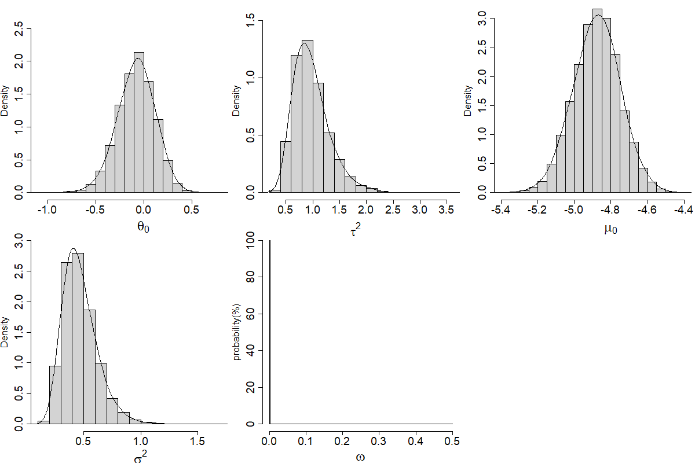

# metaFlexB
This is a README file of the R package _metaFlexB_. In our paper, we develop new Bayesian procedures for estimating and testing the overall treatment effect and inter-study heterogeneity in random-effects meta-analysis of rare binary events.

## Installation of the package

To install our package, you may execute the following codes:

```{r, eval = FALSE}
install.packages("devtools")
devtools::install_github("chriszhangm/metaFlexB")
library(metaFlexB)
```
For Mac Users who cannot compile the code, please refer [this answer](https://thecoatlessprofessor.com/programming/cpp/r-compiler-tools-for-rcpp-on-macos/).

## A example of using _metaFlexB_

We show a toy example to apply the function `main_draw`, which produces random posterior draws of global parameters of interest, and the function `metatest`, which will report a model selection result using one of criteria {AIC, BIC, DIC, BST}.

### Generate data

We will generate a dataset containing 50 independent trials with rare background incident rates.
```{r, eval = FALSE}
----------------------------------------------------------
#nct(k): generate k studies(sample size 50~1000).
#Pct(mu,k,theta,tauS,w): probabilities developing rare events given parameters.
##mu: the background incidence rate.
##k: the number of studies.
##theta: the overall treatment effect.
##tauS: the heterogeneity parameter.
##w: the direction paramter.

#Xct(nct,Pct): generate total events for k studies.
----------------------------------------------------------

nct<-function(k)
{nt<-rep(NA,k)
  nc<-rep(NA,k)
  nc<-runif(k,min=50,max=1000)
  nt<- runif(k,min=50,max=1000)         
  nct<-rbind(round(nc),round(nt))
  return(nct)
}
#####################################################################

Pct<-function(mu,k,theta,tauS,w)
{
  epsi1<-rnorm(k,0,sqrt(0.5))  #sigmaS=0.5
  epsi2<-rnorm(k,0,sqrt(tauS))
  pt<-exp(mu+epsi1+(1-w)*(theta+epsi2))/(1+exp(mu+epsi1+(1-w)*(theta+epsi2)))
  pc<-exp(mu+epsi1-w*(theta+epsi2))/(1+exp(mu+epsi1-w*(theta+epsi2)))
  p<-rbind(pc,pt)
  return(p)
}
#####################################################################
Xct = function(nct,Pct){
  k<-length(nct[1,])
  Xt<-rep(NA,k)
  Xc<-rep(NA,k)
  for(i in 1:k)
  {
    Xc[i]<-rbinom(1,nct[1,i],Pct[1,i])
    Xt[i]<-rbinom(1,nct[2,i],Pct[2,i])
  }
  Xct<-rbind(Xc,Xt)
  return(Xct)
}

----------------------------------------------------------
set.seed(1234)
#generate large size data (k=50)
nnn = nct(k = 50)
ppp = Pct(mu = -5,k = 50,theta = 0,tauS = 0.8,w = 0)
xxx = Xct(nnn,ppp)
#> xxx
#   [,1] [,2] [,3] [,4] [,5] [,6] [,7] [,8] [,9] [,10] [,11] [,12] [,13] [,14] [,15] [,16] [,17] [,18] [,19] [,20] [,21] [,22] [,23] [,24] [,25]
#Xc    0    3    4    1    5   10    1    0   11     1     5    21     1     3     3    22     1     1     3     1     6     1     1     0     9
#Xt    2    1    2    4    1    7    4    2    5     4    11     1     0     0     4    34     0    16     6     5     0     0     4    13    13
#   [,26] [,27] [,28] [,29] [,30] [,31] [,32] [,33] [,34] [,35] [,36] [,37] [,38] [,39] [,40] [,41] [,42] [,43] [,44] [,45] [,46] [,47] [,48] [,49]
#Xc     6     3     5     9     0     2     5     0     4     2     8     2     0     7     1     1     3     5    14     2     5     4     6     3
#Xt    10     1     0     0     4    17     4     0    11     2     6     4     0     2     0     0    27    13     3     2     4     5     0     8
#   [,50]
#Xc    22
#Xt    34
#> nnn
#     [,1] [,2] [,3] [,4] [,5] [,6] [,7] [,8] [,9] [,10] [,11] [,12] [,13] [,14] [,15] [,16] [,17] [,18] [,19] [,20] [,21] [,22] [,23] [,24] [,25]
#[1,]  158  641  629  642  868  658   59  271  683   539   709   568   319   927   328   845   322   303   227   271   351   338   201    88   258
#[2,]  120  344  731  529  195  529  519  764  216   856   872    90   351    63   277   721   343   533    99   586   165   898    64   794   135
#     [,26] [,27] [,28] [,29] [,30] [,31] [,32] [,33] [,34] [,35] [,36] [,37] [,38] [,39] [,40] [,41] [,42] [,43] [,44] [,45] [,46] [,47] [,48]
#[1,]   820   549   919   840    93   483   302   339   532   222   772   241   296   993   817   576   664   346   641   363   527   693   511
#[2,]   543   415   117   355   685   930   498   185   567   236   904   420   345   202   901   208   905   177   175   150   536   335    75
#     [,49] [,50]
#[1,]   282   777
#[2,]   344   755
```

### FlexB point estimates using `main_draw`
```{r, eval = FALSE}
rrr = main_draw(10000,xxx,nnn)
mean(rrr$theta0[2500:10000]) #-0.07
median(rrr$tauS[2500:10000]) #0.94
mean(rrr$mu0[2500:10000]) #-4.88
median(rrr$sigmaS[2500:10000]) #0.43
table(rrr$w[2500:10000]) #prob(w==0) = 0.999

#computation time (based on 64-bit operating system; i7-7700HQ CPU @2.8GHz 2.8GHz; 8-cores)
system.time(expr=main_draw(10000,xxx,nnn)) #2.13s
```

### Posterior densities of all global parameters
```{r,eval=FALSE}
#set margins
par(mar = c(4.3, 4.2, 0.2, 0.5))
par(mfrow=c(2,3))
hist(rrr$theta0[2500:10000],freq = F,main = '',xlab='',cex.lab=1.5,cex.axis=1.8,ylim=c(0,2.8))
text(0,par("usr")[3]-0.4,expression(bold(theta[0])),cex=2.2,xpd=NA)
lines(density(rrr$theta0[2500:10000],adjust = 2))
hist(rrr$tauS[2500:10000],freq = F,main = '',xlab='',ylim=c(0,1.6),cex.lab=1.5,cex.axis=1.8)
text(1.8,par("usr")[3]-0.25,expression(bold(tau^2)),cex=2.2,xpd=NA)
lines(density(rrr$tauS[2500:10000],adjust = 2))
hist(rrr$mu0[2500:10000],freq = F,main = '',xlab='',cex.lab=1.5,cex.axis=1.8)
text(-4.8,par("usr")[3]-0.5,expression(bold(mu[0])),cex=2.2,xpd=NA)
lines(density(rrr$mu0[2500:10000],adjust = 2))
hist(rrr$sigmaS[2500:10000],freq = F,main = '',xlab='',ylim=c(0,3),cex.lab=1.5,cex.axis=1.8)
text(1,par("usr")[3]-0.4,expression(bold(sigma^2)),cex=2.2,xpd=NA)
lines(density(rrr$sigmaS[2500:10000],adjust = 2))
h.mi =hist(rrr$w[2500:10000],plot=FALSE,breaks=500)# to avoid the plot of the histogram
h.mi$density = h.mi$counts/sum(h.mi$counts)*100
plot(h.mi,freq=FALSE,ylab='probability(%)',main='',xlab='',cex.lab=1.5,cex.axis=1.8,bty='n')
text(0.25,par("usr")[3]-14,expression(bold(omega)),cex=2.2,xpd=NA)
```


### Model Selection using `metatest`
```{r,eval=FALSE}
library(lme4)
library(rjags)
metatest(xxx,nnn,"AIC")
# Treatment effects: No.
# Inter-study heterogeneity of treatment effects: Yes.
metatest(xxx,nnn,"BIC")
# Treatment effects: No.
# Inter-study heterogeneity of treatment effects: Yes.
metatest(xxx,nnn,"DIC")
# Treatment effects: No.
# Inter-study heterogeneity of treatment effects: Yes.
metatest(xxx,nnn,"BST")
# Treatment effects: No.
# Inter-study heterogeneity of treatment effects: Yes.
```

### Citation
### Issues
Please contact to mingz@smu.edu for any issue with _metaFlexB_.
